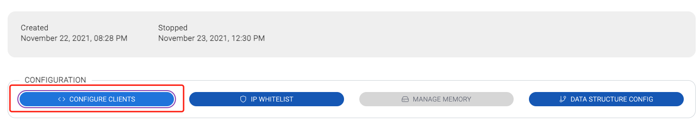
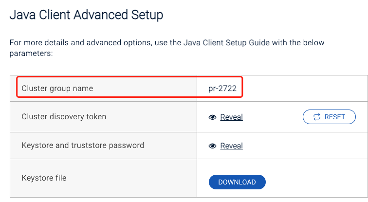
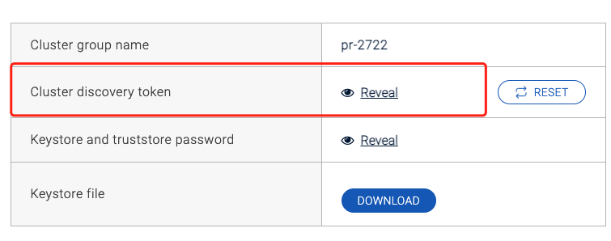

## **連接配置幫助**

### **1. Hazelcast Cloud 安裝說明**

請遵循以下說明以確保在 Tapdata 中成功添加和使用Hazelcast Cloud數據庫。

### **2. 限制說明**
Tapdata系統支持 hazelcast cloud 作為目標。

### **3. 配置說明**
- 以下配置，均可在Hazelcast集群配置中獲取

- 集群名稱(Cluster Name)：集群名稱

- Token: 鑑權秘鑰

- 是否開啟ssl(Enable SSL): 是否使用SSL加密協議
- Key Store File: client.keystore文件
- Trust Key Store File: client.truststore文件

- Key File Password: ssl文件的密碼

